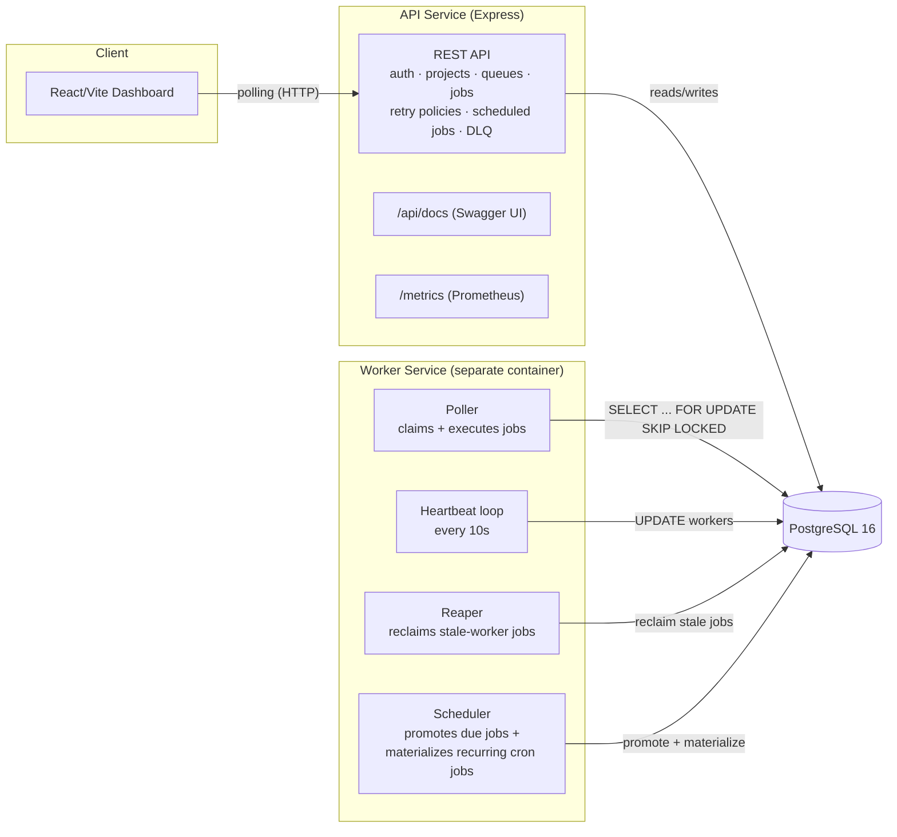
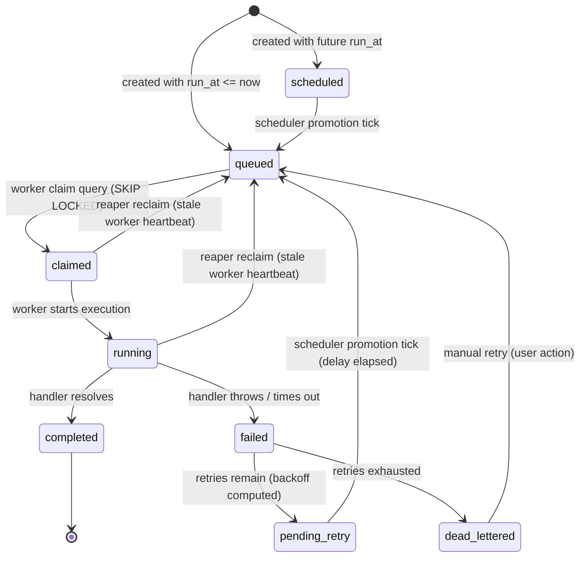

# Architecture

## System overview

- **API service**: stateless Express/TypeScript process. Owns all configuration and
  read/write endpoints (auth, orgs/projects, queues, jobs, retry policies, scheduled
  jobs, dead letter queue). It never claims or executes a job itself.
- **Worker service**: a separate container/process (scaled independently from the
  API) running four concurrent loops against the same Postgres instance:
  - **Poller**: every `POLL_INTERVAL_MS`, walks non-paused queues by priority,
    computes remaining per-queue/per-worker capacity from live DB counts, and runs
    the atomic claim query (`FOR UPDATE SKIP LOCKED`) to pick up due jobs.
  - **Heartbeat**: every `HEARTBEAT_INTERVAL_MS`, updates `workers.last_heartbeat_at`
    and appends a `worker_heartbeats` row.
  - **Reaper**: every `REAPER_INTERVAL_MS`, reclaims jobs held by workers whose
    heartbeat is older than `REAPER_STALE_THRESHOLD_MS` and marks those workers
    offline.
  - **Scheduler**: promotes due `scheduled`/`pending_retry` jobs back to `queued`,
    and materializes due recurring `scheduled_jobs` templates into new `jobs` rows,
    advancing `next_run_at` via cron-parser.
- **PostgreSQL** is the single source of truth and the only coordination point
  between workers — there is no message broker and no distributed lock beyond
  `SKIP LOCKED` (see `design-decisions.md`).
- **Dashboard** polls the REST API on an interval (no WebSockets) for queue health,
  worker status, job explorer/logs, and throughput charts.

## Job lifecycle (high level)

See `er-diagram.md` for the full relational schema and `design-decisions.md` for
the reasoning behind the polling model, at-least-once delivery, and heartbeat-based
failure detection.
