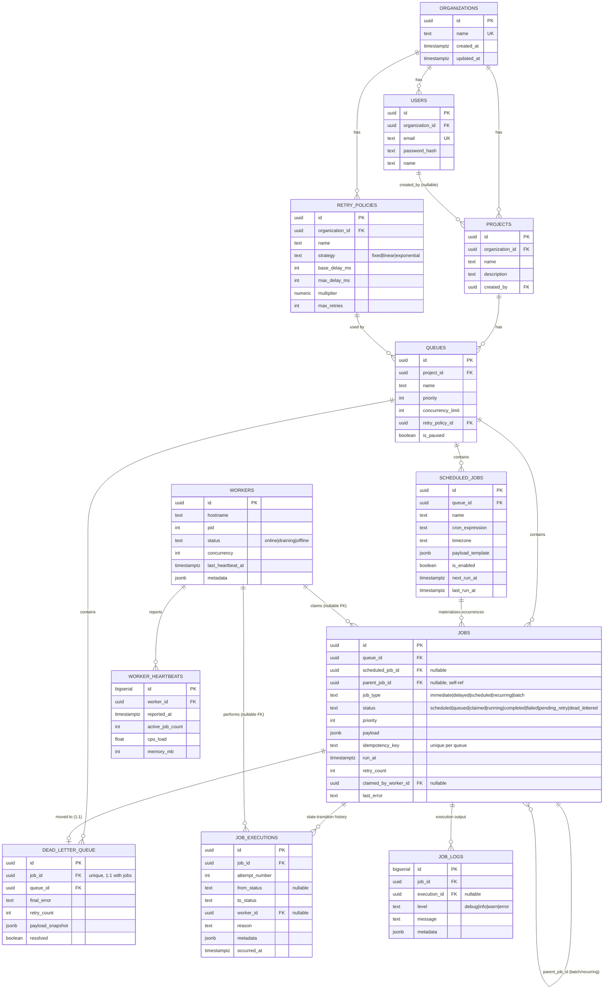

# Entity-Relationship Diagram

## Notes on normalization and indexing

- **`scheduled_jobs` is a separate table from `jobs`**: it models a recurring
  *template* (cron expression, timezone, payload template, `next_run_at`) that
  spawns many `jobs` rows over time. A plain delayed/scheduled one-off job is just
  a `jobs` row with a future `run_at` — no separate table needed for that case.
- **`job_executions`** is the append-only state-transition audit trail (one row per
  transition). **`job_logs`** is a separate table for arbitrary handler-emitted log
  lines — a distinct concern from lifecycle transitions.
- **`workers.last_heartbeat_at`** is denormalized from `worker_heartbeats` (which
  keeps full history for health charts) so the reaper's "find stale workers" query
  is a single indexed column comparison, not an aggregate over a time-series table.
- **The composite index `jobs(queue_id, status, run_at)`** exists specifically for
  the claim query's `WHERE queue_id = $1 AND status = 'queued' AND run_at <= now()
  ORDER BY priority DESC, run_at ASC` — the hottest query path in the system.
- **Cascade behavior**: deleting an organization cascades through projects, queues,
  jobs, job_executions, job_logs, and dead_letter_queue. Deleting a `retry_policies`
  row is `ON DELETE RESTRICT` (a queue must always have a valid policy). Deleting a
  `workers` row sets `jobs.claimed_by_worker_id` / `job_executions.worker_id` to
  `NULL` rather than cascading, since job history must outlive the worker that ran
  it.
- **Enums are `CHECK` constraints**, not native Postgres `ENUM` types, so adding a
  new status later is `ALTER TABLE ... DROP/ADD CONSTRAINT`, not a type migration.
